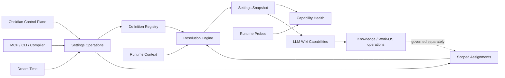

# LLM Wiki Settings Platform domain model v0

## Outcome

LLM Wiki needs one first-class **Settings Platform**, not a link-diagnostics settings page and not a larger Obsidian `data.json`. It owns a versioned definition registry, scoped assignments, deterministic resolution, immutable effective snapshots, validation, migration, secret references, and capability health. Every host uses the same operations; Obsidian is the primary human-facing control plane, not the source of truth.

This draft is the domain contract for the first prototype. It deliberately does not choose a database, serialization library, UI framework, or RPC transport.

## Bounded context

The Settings Platform owns:

- what operational settings exist and which capability owns each definition;
- values assigned at supported scopes and the provenance of those assignments;
- deterministic calculation of an effective value for a runtime context;
- schema versions, validation, migration, atomic mutation, and recovery metadata;
- opaque references to secrets, never secret material;
- explained capability health derived from configuration and runtime probes;
- a host-neutral operation and event contract.

It does not own:

- durable knowledge claims, project truth, issues, memories, or promotion decisions;
- the behavior of the `obc` link-diagnostics package, compiler, query adapters, providers, plugin lifecycle, publishing, cycles, or Dream Time;
- credential values or the backing secret store;
- Obsidian forms, CLI flags, MCP response envelopes, or runtime-specific transport;
- execution scheduling. A capability may read a snapshot and run, but Settings does not become a daemon.

## Context relationships



The dashed relationship is intentional: knowledge and work may propose a settings change, but only Settings operations can commit one. A setting change never promotes a knowledge claim.

## Aggregate model

### Settings Registry

The aggregate root for the definition catalog.

```text
SettingsRegistry
  schemaVersion
  definitions: SettingDefinition[]
  migrations: SettingsMigration[]
  registryDigest
```

`SettingDefinition`:

| Field | Meaning |
|---|---|
| `key` | Stable namespaced identity such as `query.semantic.provider` |
| `owner` | Capability that defines and validates the setting |
| `valueType` | Boolean, integer, number, string, enum, path, duration, list, object, or secret-reference |
| `defaultValue` | Product default when the setting is not required and no assignment wins |
| `allowedScopes` | Scopes at which assignment is legal |
| `sensitivity` | `public`, `local`, or `secret-reference` |
| `validator` | Stable validator identity and constraints, not executable UI code |
| `requires` | Capability or setting dependencies needed for the value to be useful |
| `applyMode` | `hot`, `next-operation`, or `restart-required` |
| `visibility` | `normal`, `advanced`, or `internal` |
| `deprecatedBy` | Replacement key when the definition is being retired |

Definitions are product metadata. Hosts may render them, but cannot invent or reinterpret them.

### Scoped Settings

The aggregate that owns assignments for one scope target.

```text
ScopedSettings
  scope: product | user-device | vault | workspace-project | session
  targetId
  revision
  schemaVersion
  assignments: SettingAssignment[]
  updatedAt
  updatedBy
```

`SettingAssignment` contains `key`, typed `value` or `secretRef`, provenance, and optional expiry for session overrides. It never copies a product default and never contains plaintext secret material.

### Settings Snapshot

An immutable resolution product for a specific `RuntimeContext`:

```text
RuntimeContext
  userDeviceId
  vaultId?
  workspaceProjectId?
  sessionId?

SettingsSnapshot
  snapshotId
  registryVersion
  context
  effective: EffectiveSetting[]
  sourceRevisions
  createdAt
```

Each `EffectiveSetting` contains `key`, redacted effective value, winning scope, assignment provenance, validation state, apply mode, and overridden candidates. This makes “why is this the value?” a domain query, not UI guesswork.

### Secret Reference

```text
SecretReference
  provider: os-keychain | environment | external-vault
  locator
  version?
```

The Settings Platform may validate syntax and ask a secret provider whether a reference resolves. It may return `present`, `missing`, or `unreachable`; it must never return the resolved secret. Import/export includes references only when explicitly requested and still never includes secret values.

### Capability Health

```text
CapabilityHealth
  capabilityId
  state: available | degraded | unavailable | disabled
  summary
  evidence: HealthEvidence[]
  remediations: Remediation[]
  checkedAt
  snapshotId
```

Health combines registry requirements, effective settings, secret presence, runtime discovery, and capability-owned probes. `disabled` is intentional user policy; `unavailable` means the requested capability cannot run; `degraded` means a useful reduced path remains. Link-diagnostics findings, broken links, or stale notes are diagnostic results—not Capability Health.

## Scope precedence

Resolution is deterministic from most specific to least specific:

```text
session > workspace-project > vault > user-device > product default
```

Rules:

1. A scope participates only when present in the `RuntimeContext` and allowed by the definition.
2. “Unset” reveals the next lower assignment; it is not a stored null override.
3. Required settings without a winning value are invalid; they do not silently acquire empty strings.
4. A value of `false`, `0`, an empty list, or an empty object is still an explicit value when the type permits it.
5. Environment variables and CLI flags are adapters into a declared user-device or session assignment. They are not an undocumented sixth precedence layer.
6. Product defaults come only from the versioned registry and cannot be mutated locally.
7. Snapshot creation either succeeds with a complete explanation or returns validation failures; consumers never merge layers themselves.

## Commands, queries, and events

The host-neutral operation surface is:

| Kind | Operation | Contract |
|---|---|---|
| Query | `settings.definitions.list/get` | Discover canonical definitions and presentation metadata |
| Query | `settings.scopes.get` | Read redacted assignments and revision for one scope target |
| Query | `settings.snapshot.resolve/explain` | Resolve all settings or explain one effective value |
| Command | `settings.assignment.set/unset` | Optimistic, validated mutation against an expected revision |
| Command | `settings.scope.reset` | Plan first, then remove selected assignments atomically |
| Command | `settings.import.plan/apply` | Validate, migrate, diff, then atomically apply |
| Query | `settings.export` | Export definitions or redacted assignments; never secrets |
| Query | `settings.validate` | Validate definitions, assignments, and cross-setting constraints |
| Query | `settings.doctor` | Combine validation, discovery, secret presence, and capability probes |
| Query | `settings.migrations.plan` | Explain required schema migrations without writing |

Every mutating operation uses expected revision, validates the complete affected scope, writes atomically, records a recoverable previous revision, and emits events only after commit.

Canonical events:

- `SettingsAssignmentsChanged`
- `SettingsRegistryChanged`
- `SettingsSnapshotInvalidated`
- `CapabilityHealthChanged`

Events contain keys, scope identity, revisions, and redacted metadata. They never contain secret values.

## Invariants

1. A setting key has exactly one owning capability and one active definition per registry version.
2. Hosts do not parse or merge independent configuration after bootstrap; they consume a resolved snapshot.
3. A mutation cannot commit when its expected scope revision is stale.
4. A snapshot identifies every source revision used to create it.
5. Secret values never enter assignments, snapshots, events, logs, exports, Obsidian `data.json`, or durable knowledge.
6. Operational settings never become reviewed knowledge authority, and knowledge writes never bypass Settings mutation rules.
7. Capability health is evidence-backed and time-bound; it is not inferred from the presence of a form value alone.
8. Disabled, unavailable, degraded, and diagnostic failure remain distinct states.
9. Python and TypeScript must resolve the same fixture registry and assignments to byte-equivalent canonical snapshots after redaction.
10. Existing engines remain authoritative for their behavior; Settings stores configuration and delegates health probes and actions.

## Boundary scenarios

### One vault, two devices, one project override

Device A points to Python at one machine-local path; Device B uses another. The vault enables semantic query for everyone, while Project X temporarily selects a different model. The effective value comes from the project assignment, the executable path comes from each user-device assignment, and neither machine path is written to the vault or Git.

### Obsidian is closed

The MCP server and CLI resolve the same persisted scopes and registry without Obsidian. When Obsidian reopens, it reads definitions and the current revisions through Settings operations; its `data.json` may hold presentation preferences only.

### Missing secret with a useful fallback

Web search references an absent API credential, while local filesystem query is healthy. `settings.doctor` reports web search `unavailable` and unified query `degraded`, with remediation to bind the secret reference. No API key is returned to any host.

### Link-diagnostics semantic dependency is absent

Deterministic link checks remain available; semantic suggestions are unavailable because their optional runtime dependency is missing. LLM Wiki link-diagnostics health is `degraded`, while actual broken-link results remain a separate diagnostic run output.

### Concurrent editors

Obsidian reads vault-scope revision 12 while a CLI import commits revision 13. Obsidian's mutation against revision 12 fails with a conflict and receives a redacted diff; it must refresh rather than overwrite revision 13.

### Registry upgrade removes a key

An upgrade supplies an explicit migration from the deprecated key. The system plans the migration, backs up the prior scoped document, validates the migrated result, and commits a new revision. Unknown keys are quarantined and reported; they are never silently discarded.

## Obsidian control-plane projection

The control plane is a projection over definitions and health, grouped by capability rather than by storage file:

1. Overview and Doctor
2. Runtime and Vault
3. Knowledge and Memory
4. Work-OS
5. Query and Index
6. Sources, Providers, and Connectors
7. Diagnostics, including link diagnostics
8. Community Plugins
9. Daily / Weekly / Monthly Cycles
10. Publishing
11. Dream Time
12. Security and Secrets
13. Advanced

Every field can show effective value, winning scope, provenance, validation, apply mode, and health. Actions such as a link-diagnostics run, plugin install, compile, or publish are capability operations linked from the control plane; they are not setting mutations.

## First vertical slice

The smallest slice that proves the architecture is not an isolated UI mock:

1. Register a handful of real definitions: vault identity/path, Python runtime path, query semantic enablement, link-diagnostics semantic enablement, and one provider secret reference.
2. Persist user-device and vault assignments with revision checks and atomic backup.
3. Resolve/explain one canonical snapshot in both Python and TypeScript from shared fixtures.
4. Expose definitions, snapshot, set/unset, validate, and doctor through the Operation Interface.
5. Replace the current Obsidian plugin's direct `pythonPath` storage with these operations while preserving unrelated plugin `data.json`.
6. Show Overview/Doctor plus Runtime, Vault, Query, and Diagnostics sections.
7. Prove CLI and MCP still work while Obsidian is closed.

This slice establishes the settings spine; later capabilities register definitions and health probes without redesigning the platform.

## Acceptance specification

- One namespaced registry describes every setting exposed in the first slice.
- Python and TypeScript conformance fixtures produce equivalent effective values, provenance, validation, and redaction.
- Scope precedence and unset semantics pass boundary tests for every supported type.
- Stale revisions cannot overwrite newer assignments.
- Failed validation or migration leaves both active state and backup state intact.
- Secret values are absent from persisted settings, operation results, events, logs, exports, and Obsidian plugin storage.
- Doctor distinguishes `available`, `degraded`, `unavailable`, and `disabled` with evidence and remediation.
- Obsidian contains no duplicated link-diagnostics, plugin lifecycle, query, or compiler business logic.
- MCP, CLI, and Obsidian use the same operation contracts and explain the same effective values.
- Operational settings remain outside Knowledge Item and Promotion Policy authority.

## Decisions still requiring prototype feedback

The domain boundaries above are stable enough to prototype. The following presentation and rollout choices should be tested rather than prematurely fixed:

- whether the Obsidian surface is a conventional settings tab, a dedicated control-center view, or both;
- how much scope/provenance detail is visible by default versus an advanced inspector;
- whether workspace-project settings are stored per project entity or in one vault-local scoped document;
- which secret providers ship in the first release beyond environment references;
- whether import/export is primarily a portability flow, a support bundle, or both.
