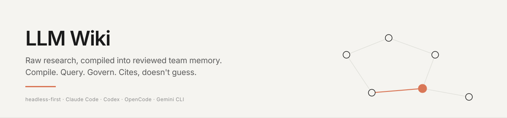

<p align="center">
  
</p>

# LLM Wiki

**LLM Wiki convierte la carpeta de investigación bruta de un equipo en una wiki de Obsidian revisada, consultable y que se mejora a sí misma. Headless-first. Cita, no adivina.**

[](LICENSE)
[](https://modelcontextprotocol.io)
[](https://github.com/2233admin/obsidian-llm-wiki/wiki)

**Idioma**: Español (esta página) · [简体中文](docs/zh-CN/) — **Guía**: [English](docs/GUIDE.md) · [简体中文](docs/GUIDE.zh-CN.md) — **Wiki**: [Inicio](https://github.com/2233admin/obsidian-llm-wiki/wiki) · [Arquitectura](https://github.com/2233admin/obsidian-llm-wiki/wiki/Architecture) · [Racional](https://github.com/2233admin/obsidian-llm-wiki/wiki/Rationale) · [FAQ](https://github.com/2233admin/obsidian-llm-wiki/wiki/FAQ)


Estás leyendo esto porque tu equipo ya ha perdido conocimiento.

No porque nadie lo haya escrito. Lo hicieron: artículos, notas de reuniones, hallazgos de repositorios, capturas de pantalla, respuestas de agentes. El problema es peor: el conocimiento no tiene estado. No tiene fuente. No tiene revisor. No tiene camino de promoción. No hay forma de distinguir un borrador de la verdad del equipo.

LLM Wiki le da a ese caos un paso de compilación:

```
capturar -> compilar -> preguntar -> archivar -> revisar -> promover
```

Coloca el material fuente en `raw/`. Compílalo en resúmenes de `wiki/`, páginas de conceptos, backlinks e informes de contradicciones. Haz preguntas citadas a los agentes. Archiva las respuestas útiles en `00-Inbox/AI-Output/`. Promueve solo el conocimiento revisado hacia decisiones, arquitectura y runbooks.

No es un compañero de IA. Es un compilador de memoria de equipo revisada. Obsidian es el IDE, la revisión de Git/Gitea es el libro mayor, y las herramientas MCP/CLI son la superficie de ejecución.

Inspirado en [LLM Wiki de Andrej Karpathy](https://github.com/karpathy/llm-wiki). Markdown es la fuente de verdad; el compilador convierte la estructura en un grafo; MCP lo expone.

---

## Inicio rápido (10 segundos, Claude Code)

Dentro de cualquier sesión de Claude Code:

```
/plugin marketplace add 2233admin/obsidian-llm-wiki
/plugin install llmwiki@obsidian-llm-wiki
```

Eso es todo. Sin clonar, sin compilar, sin archivo de configuración que editar. El plugin incluye el servidor MCP (se ejecuta desde el directorio del plugin, Node 20+), todos los roles de trabajo de conocimiento `/llmwiki:vault-*` y los comandos de pensamiento/investigación. Inicia Claude Code dentro de tu vault y el servidor lo encontrará automáticamente (el cwd es el vault); de lo contrario, establece `VAULT_MIND_VAULT_PATH` o coloca un `vault-mind.yaml`.

### Otros hosts (Codex / OpenCode / Gemini)

```bash
git clone --depth 1 https://github.com/2233admin/obsidian-llm-wiki.git
cd obsidian-llm-wiki && ./setup                      # --host codex | opencode | gemini
```

Windows: `.\setup.ps1`. El script copia el paquete de habilidades en el directorio de habilidades de tu host e imprime el fragmento `.mcp.json` para pegar en la configuración de tu agente. [docs/INSTALL.md](docs/INSTALL.md) tiene las rutas por host y la receta manual.

### Instalar el plugin de Obsidian

Durante la beta, instala [BRAT](https://github.com/TfTHacker/obsidian42-brat), elige
**Add a beta plugin** e ingresa
`https://github.com/2233admin/obsidian-llm-wiki`. Activa **LLM Wiki** después de que BRAT
lo instale. Una vez que el plugin sea aceptado en el directorio de Community Plugins de Obsidian, instálalo allí buscando **LLM Wiki**.

Alternativa manual: descarga `main.js`, `manifest.json` y `styles.css` desde un release de versión del plugin en GitHub y colócalos en
`<vault>/.obsidian/plugins/vault-mind-promote/`.

### Recuerdo: palabras clave predeterminado, semántico opcional

El recuerdo en lenguaje natural funciona con **configuración cero**. El primer `context.recall` /
`query.answer` contra un vault nuevo indexa perezosamente tus notas (palabras clave: Postgres
full-text + trigram, sin embeddings, sin daemon), por lo que un agente puede hacer preguntas
inmediatamente — los vaults grandes se indexan en segundo plano y se refinan al terminar.

**El recuerdo semántico (vectorial) es una mejora opcional**: ejecuta [Ollama](https://ollama.com)
con `ollama pull bge-m3` (o apunta `VAULT_MIND_EMBED_URL` a cualquier endpoint de
embeddings compatible con OpenAI). Las respuestas de recuerdo te indicarán cuándo el semántico está apagado y cómo activarlo; el recuerdo por palabras clave seguirá funcionando independientemente.

---

## Ver el ciclo (5 minutos)

Puedes verificar el ciclo del compilador antes de conectar cualquier host de agente. Esta demo es local, solo genera informes, y la ejecución simulada del compilador utiliza extracción simulada (stub), por lo que no necesita una clave de API.

```bash
python compiler/compile.py examples/collab-vault/research-compiler --tier haiku --dry-run
python scripts/knowledge_health.py --vault examples/collab-vault --json
python scripts/llmwiki_doctor.py --vault examples/collab-vault --json
```

Luego inspecciona el antes/después:

| Paso | Ruta |
|---|---|
| Fuente bruta | `examples/collab-vault/research-compiler/raw/team-memory-os.md` |
| Resumen compilado | `examples/collab-vault/research-compiler/wiki/summaries/team-memory-os.md` |
| Concepto compilado | `examples/collab-vault/research-compiler/wiki/concepts/team-memory-os.md` |
| Salida de IA archivada | `examples/collab-vault/00-Inbox/AI-Output/codex/project-setup-proposal.md` |
| Memoria revisada | `examples/collab-vault/20-Decisions/2026-05-16-gitea-reviewed-vault.md` |

Ese es el producto: el material bruto se convierte en memoria de equipo citada, inspeccionable y revisable.

---

## Funciona con

Cualquier host compatible con MCP:

| Host | Comando | Estado |
|---|---|---|
| Claude Code | `./setup --host claude` | objetivo principal, totalmente probado |
| Codex CLI | `./setup --host codex` | ruta configurada, prueba de humo realizada |
| OpenCode | `./setup --host opencode` | ruta configurada, prueba de humo realizada |
| Gemini CLI | `./setup --host gemini` | ruta configurada, prueba de humo realizada |

Cualquier otra cosa que hable transporte stdio MCP debería funcionar — el script `setup` solo copia las habilidades en el directorio correcto e imprime el fragmento `.mcp.json`. Si tu host lee la configuración MCP de otro lugar, pega el fragmento allí manualmente.

---

## Ejemplos de prompts

Arranque en frío -- sin contexto de vault:

```
/vault-librarian what do I know about attention heads
```

Arranque caliente -- especifica una nota que tienes:

```
/vault-librarian explain [[retrieval-augmented-generation]] in the context of my other notes on LLMs
```

Específico de formato -- quieres una lista, no prosa:

```
/vault-historian what decisions did I make about training data between January and March 2026
```

Iterar -- refinar una respuesta:

```
/vault-curator find all orphan notes and stale notes in my vault that have not been updated in 90 days
```

---

## Compilar, Consultar, Gobernar

| Ciclo | Qué sucede | Ruta durable |
|---|---|---|
| Compilar | Coloca material fuente en `raw/`; ejecuta el compilador para producir resúmenes, conceptos, backlinks e informes de contradicción. | `wiki/` |
| Consultar | Los agentes responden basándose en notas citadas del vault y archivan borradores útiles en el inbox. | `00-Inbox/AI-Output/<agent>/` |
| Gobernar | Los humanos revisan, promueven, sustituyen o descartan el conocimiento candidato. La memoria compartida del equipo se mueve a través de revisión de PR. | `20-Decisions/`, `30-Architecture/`, `40-Runbooks/` |

Consulta [docs/RESEARCH_COMPILER_LOOP.md](docs/RESEARCH_COMPILER_LOOP.md) para el ciclo operativo estándar.

---

## Plano de control único de configuración y proyecto

LLM Wiki utiliza una **Plataforma de Configuración** neutral al host en todo MCP, el compilador/CLI de Python y el plano de control de Obsidian. La resolución de configuraciones efectivas sigue este orden:

```text
sesión > proyecto-espacio de trabajo > vault > dispositivo-usuario > predeterminado del producto
```

Obsidian es un cliente de esa plataforma, no un backend de configuración separado. Sus datos de plugin mantienen solo preferencias de presentación, una vinculación de dispositivo local a la máquina y el diario de migración heredada reversible. Los valores operativos pertenecen a documentos de Configuración con alcance definido. Las credenciales se representan únicamente mediante una **Referencia Secreta**; los valores secretos resueltos nunca entran en snapshots, Project Hubs, datos de plugins o conocimiento durable del vault.

El mismo plano de control gestiona la conexión del modelo de Agente predeterminado. `inherit` preserva las configuraciones de env/YAML existentes, `local` soporta Ollama u otro endpoint compatible con OpenAI sin reenviar credenciales de la nube, y `cloud` resuelve una Referencia Secreta local al dispositivo solo para el proceso hijo del modelo.

Los proyectos utilizan la identidad estable `project/<slug>`. El checkout del repositorio, la ruta del vault, el ítem de Linear/GitHub y la tarea de 5090/Orca son vinculaciones o proyecciones de ese Proyecto, nunca reemplazos de su identidad. La operación de solo lectura `project.hub.get` ensambla el trabajo, el conocimiento, las Ejecuciones de Trabajo, la configuración efectiva, la salud de las capacidades, la salud del espacio de trabajo y la deriva de integración sin convertirse en una nueva fuente de verdad.

Consulta [Settings and Obsidian control plane](docs/SETTINGS.md), [Agent Wiki toolchain](docs/AGENT_WIKI_TOOLCHAIN.md), [Project and state migrations](docs/MIGRATIONS.md) y el [capability inventory](docs/CAPABILITY_INVENTORY.md).

---

## Gestión de proyectos estilo Linear local

LLM Wiki incluye una capa de gestión de proyectos estilo Linear, local-first, bajo `project.*`. Almacena incidencias, comentarios y dependencias como Markdown revisable y deriva vistas de Kanban, Canvas y Bases de ellas. Los agentes pueden crear y actualizar elementos de trabajo a través de MCP, mientras que los humanos pueden inspeccionar los mismos archivos y diffs de Git.

El trabajo actual vive solo en `01-Projects/<project>/issues/<slug>.md`; `10-Projects/<project>/docket/**` ha sido retirado. El conocimiento del proyecto permanece en `10-Projects/<project>/`, y el registro compartido del proyecto es `Projects/<project>.md`. Consulta [docs/LOCAL_PROJECTS.md](docs/LOCAL_PROJECTS.md).

## Capa visual de Obsidian

La gestión de proyectos puede exportar vistas nativas de Obsidian sin requerir que Obsidian esté ejecutándose. Usa `project.canvas.export` para `01-Projects/<project>/views/project-map.canvas`, y `project.base.export` para `01-Projects/<project>/views/issues.base`. Canvas ofrece un mapa espacial del proyecto; Bases ofrece un tablero de tabla sobre las propiedades de las incidencias. Kanban sigue siendo el adaptador de tablero de lectura de terceros soportado; Dataview y Tasks son alternativas avanzadas opcionales, no dependencias obligatorias.

El paquete `obc` sigue siendo la capacidad de compatibilidad y diagnóstico de enlaces del **Obsidian Broken Link Checker**. OBC no es el nombre del producto y no posee los ajustes del sistema; consume snapshots de la Plataforma de Configuración de LLM Wiki como cualquier otra capacidad.

## Ingesta estilo NotebookLM local con ChubbySkills

LLM Wiki ahora puede tratar a [chubbyguan/chubbyskills](https://github.com/chubbyguan/chubbyskills) como un paquete de ingesta local opcional. ChubbySkills maneja la captura y transcripción de plataformas como Douyin, Bilibili, Xiaohongshu, WeChat, X/Twitter, podcasts, YouTube y más; LLM Wiki maneja la capa del vault local: búsqueda, citas, grafo, memoria Markdown, revisión de AI-Output y promoción.

Instala LLM Wiki normalmente, luego usa `/chubbyskills` para planificar qué habilidades de captura ascendentes instalar y cómo orientarlas al mismo vault. Esto hace que la forma del producto sea más cercana a un NotebookLM local sobre tus propios feeds guardados, sin empaquetar pesadas dependencias de medios en el servidor MCP. Consulta [docs/CHUBBYSKILLS.md](docs/CHUBBYSKILLS.md).
El núcleo MCP de LLM Wiki soporta deliberadamente dos puntos de entrada de ingesta local en lugar de un scraper por plataforma:

| Punto de entrada | Maneja | Contrato |
|---|---|---|
| `OPENCLI` | Páginas web, artículos, capturas asistidas por OpenCLI + BBX/navegador, superficies de texto estilo X/Weibo/Zhihu/WeChat/Xiaohongshu. | Producir Markdown en el vault con URL de origen y metadatos de captura. |
| `MEDIA_TRANSCRIBE` | Análisis de audio/video, descarga, subtítulos, transcripción, superficies de medios estilo YouTube/Bilibili/Douyin/TikTok/Xiaohongshu/podcast. | Producir Markdown de transcripción en el vault con procedencia de medios. |

Usa `ingest.link.preflight` antes de prometer la captura. Clasifica la URL, la enruta a `OPENCLI` o a la cadena de herramientas de medios/transcripción, informa si el proveedor está configurado y devuelve la siguiente acción honesta. LLM Wiki solo reclama éxito de ingesta después de que el Markdown llega al vault y puede ser encontrado por `vault.search` o `query.unified`. Consulta [docs/INGEST.md](docs/INGEST.md). OpenTabs sigue siendo opcional; la ruta de instalación predeterminada debería funcionar con OpenCLI más el puente BBX/navegador.


## Registro de Fuentes Fase 1 {#source-registry-phase-1}

Usa `source.register` cuando una URL o una nota existente del vault deba convertirse en una fuente de larga duración antes de ejecutar cualquier ingesta pesada. El registro de URL ejecuta `ingest.link.preflight` y escribe solo dos artefactos locales al vault:

- `_llmwiki/source-registry.json` almacena el índice de máquina.
- `00-Inbox/Sources/<platform>/<source>.md` almacena la Nota de Fuente legible por humanos.
- `10-Projects/<project>/sources/<platform>/<source>.md` se utiliza cuando se proporciona el `project`.

La Fase 1 soporta `inputType=url` y `inputType=vaultPath`. Los tipos de entrada reservados como `filePath`, `directoryPath`, `repoPath` y `text` son rechazados hasta que exista una capa de ejecución de ingesta posterior. Usa `source.list` y `source.get` para inspeccionar las fuentes registradas.

## Captura de X/Twitter a Obsidian

LLM Wiki ahora incluye una habilidad opcional `/x-to-obsidian` adaptada de [hemoouren/X-to-Obsidian-SKill](https://github.com/hemoouren/X-to-Obsidian-SKill/tree/main). Encuentra publicaciones de X/Twitter de alta señal, las guarda a través del Obsidian Web Clipper oficial y luego permite que LLM Wiki busque y gobierne las notas Markdown recortadas.

Esto reside en la capa de habilidades, no en el servidor MCP: la automatización del navegador y el acceso a X con sesión iniciada permanecen locales, mientras que `vault.search`, `query.unified`, `vault.writeAIOutput` y `memory.handoff.write` manejan el flujo de trabajo del vault revisable después de que llegan las notas. Consulta [docs/X_TO_OBSIDIAN.md](docs/X_TO_OBSIDIAN.md).

## Memoria Markdown + Tableros Kanban (Fase 1)

LLM Wiki ahora tiene dos capas de memoria:

| Capa | Ruta | Uso |
|---|---|---|
| KV Ligera | `_ai_memory.json` | API `memory.set/get/list/forget` existente. Estado clave-valor privado y rápido, sin cambios. |
| Memoria Markdown | notas del vault | Estado de traspaso visible y searchable que sobrevive a las sesiones del agente y puede ser revisado como cualquier otra nota. |

La memoria Markdown tiene un alcance por actor. `VAULT_MIND_ACTOR` selecciona el actor; si no se establece, vuelve a `agent`.

| Alcance | Directorio |
|---|---|
| Memoria de proyecto | `10-Projects/<project>/agents/<actor>/memory/` |
| Memoria de respaldo | `00-Inbox/Agent-Memory/<actor>/` |

La superficie MCP añade `memory.passport.get`, `memory.passport.upsert`, `memory.handoff.latest`, `memory.handoff.write`, `memory.session.save` y `memory.session.list`. `passport.md`, `handoff.md` y `sessions/*.md` con marca de tiempo son Markdown normales, por lo que `vault.search` y `query.unified` pueden encontrarlos.

El adaptador `kanban` es de solo lectura en la Fase 1. Indexa tableros del plugin Obsidian Kanban almacenados como Markdown con `kanban-plugin: board`, emite resúmenes del tablero más resultados de tarjetas, y preserva los metadatos de carril, marcados, archivados e id de bloque. La lista de adaptadores predeterminada incluye `kanban`; si sobrescribes los adaptadores manualmente, inclúyelo explícitamente:

Las decisiones de conversación son la capa de memoria más difícil: cuando una sesión produce una elección de arquitectura, un compromiso técnico, una opción rechazada, una causa raíz de depuración o un cambio de estado del proyecto, los agentes deben capturarlo con `conversation.decision.capture` en lugar de dejarlo enterrado en el chat. Las decisiones aterrizan junto a la memoria Markdown bajo `decisions/*.md`, incluyen Resumen/Decisión/Por qué/Opciones Rechazadas/Restricciones/Acciones/Referencias/Extractos de Conversación, y son buscables mediante `vault.search`, `query.unified`, `query.trace` y `query.answer`. No almacenes transcripciones completas por defecto; pasa solo `extractos` seleccionados.

La pila de contexto estilo MemPalace se expone a través de `context.*`: inicia una nueva sesión de agente con `context.wakeup project=<project> topic=<topic>`, usa `context.recall` para una sala/tema específico, y usa `context.deep_search` cuando necesites un rastro citado más pesado. Esto mapea L0 al passport, L1 al handoff/sesiones/decisiones, L2 al recuerdo de temas y L3 a la búsqueda respaldada por rastro completo.

```bash
VAULT_MIND_ADAPTERS=filesystem,kanban
VAULT_MIND_KANBAN_GLOB='**/*.md'
```

## Roles de conocimiento, una superficie MCP

Cada comando `/vault-*` es un rol de trabajo de conocimiento sobre el mismo conjunto de herramientas MCP. Son trabajos en la tubería, no mascotas del producto.

| Nombre | Qué hace | Herramientas MCP principales |
|---|---|---|
| vault-librarian | lee, busca, cita desde el vault | `vault.search`, `vault.read`, `vault.list` |
| vault-architect | compila grafo de conceptos, sugiere refactorizaciones | `vault.graph`, `vault.backlinks`, `compile.run` |
| vault-curator | encuentra huérfanos, enlaces muertos, duplicados, notas obsoletas | `vault.lint`, `vault.searchByTag`, `vault.search` |
| vault-teacher | explica una nota en el contexto de sus vecinas | `vault.backlinks`, `vault.read`, `vault.graph` |
| vault-historian | responde qué estabas pensando en fecha X | `vault.searchByFrontmatter`, `vault.stat`, `vault.search` |
| vault-janitor | propone limpiezas, modo simulado por defecto | `vault.lint`, `vault.delete` (dry), `vault.rename` (dry) |

---

## Notas estructuradas (v2.4.0)

Seis herramientas que crean notas AI-First con frontmatter completo, wikilinks y un preámbulo "Para el futuro Claude" — seguras por defecto (`dryRun: true`).

| Herramienta | Crea | Campos clave |
|---|---|---|
| `vault.daily` | `Daily/YYYY-MM-DD.md` | humor, energía, resumen, tags |
| `vault.person` | `People/{name}.md` | rol, empresa, relación |
| `vault.project` | `Projects/{name}.md` | estado, equipo (wikilinked), resumen |
| `vault.decide` | `Decisions/YYYY-MM-DD--{slug}.md` | contexto, decisión, justificación, consecuencias |
| `vault.meeting` | `Meetings/YYYY-MM-DD--{slug}.md` | asistentes, decisiones, tareas pendientes |
| `vault.ingest` | `00-Inbox/{slug}.md` | contenido, URL de origen, tipo, preámbulo |

Cada nota recibe `ai-first: true` en el frontmatter y un preámbulo de dos frases para que un futuro Claude pueda decidir la relevancia en segundos sin leer la nota completa.

`vault.init` (v2.5.0) crea el andamiaje de un diseño de metodología — `generic`, `para`, `lyt`, o `zettelkasten` — en un vault vacío o existente, seguro por defecto (`dryRun: true`). Todas las operaciones de escritura están ahora cubiertas por bloqueo consultivo por archivo con un TTL de 60s, por lo que múltiples agentes pueden escribir en el mismo vault simultáneamente sin pisarse unos a otros. Inspirado por [claude-obsidian](https://github.com/AgriciDaniel/claude-obsidian).

---

## Comandos de pensamiento e investigación (v2.4.0)

Trece comandos slash en `commands/` para usar en cualquier sesión de Claude Code, Codex CLI, Gemini CLI o OpenCode. Ejecutan razonamiento sobre el vault usando las herramientas MCP anteriores — ninguna lógica de LLM reside en el servidor.

| Comando | Qué hace |
|---|---|---|
| `/vault-synthesize` | Escanea notas recientes en busca de patrones cross-source no nombrados; escribe notas de síntesis |
| `/vault-reconcile` | Encuentra contradicciones semánticas entre notas del vault; resuelve automáticamente o marca las ambiguas |
| `/vault-emerge` | Identifica temas que están ganando impulso en los últimos 14 días |
| `/vault-research` | Dossier de investigación web (Wikipedia, HN, arXiv, etc.) guardado en `Research/` |
| `/vault-challenge` | Abogado del diablo: saca a la luz afirmaciones débiles y contraevidencias en una nota |
| `/vault-connect` | Mapea conexiones inesperadas entre conceptos, personas y proyectos |
| `/vault-panel` | Perspectiva múltiple: genera 3–5 vistas de stakeholders con tensiones |
| `/vault-recap` | Revisión periódica (semana/mes/trimestre) basada en la actividad del vault |
| `/vault-graduate` | Decisión de graduación sobre una idea: lanzar / invertir más / archivar |
| `/vault-learn` | Extrae principios transferibles de una experiencia y los guarda en `Knowledge/` |
| `/vault-autoresearch` | Bucle de investigación autónoma de tres rondas: pregunta, investiga, refina, redacta |
| `/vault-think` | Aplica un marco de pensamiento de 10 principios a un tema o nota |
| `/vault-expand` | Expande una sola fuente en 8–15 páginas de wiki interconectadas |

Inspirado por [obsidian-second-brain](https://github.com/eugeniughelbur/obsidian-second-brain) y [claude-obsidian](https://github.com/AgriciDaniel/claude-obsidian). LLM Wiki proporciona la infraestructura; estos comandos proporcionan los patrones de flujo de trabajo que se sitúan encima.

---

## Cómo funciona (recorrido de 30 segundos)

Tus archivos markdown -- con wikilinks `[[como este]]`, aliases, tags de frontmatter y mtime -- son la fuente de verdad. El compilador convierte carpetas de temas brutas en un grafo de conceptos (nodos = notas, aristas = enlaces y relaciones semánticas), resúmenes y páginas de conceptos. El servidor MCP expone este grafo como herramientas: `vault.search`, `vault.backlinks`, `vault.graph` y más de 40 adicionales.

Cuando Claude Code (o cualquier agente compatible con MCP) ejecuta `/vault-librarian`, llama directamente a `vault.search` y `vault.read`. El agente obtiene citas -- no adivinanzas.

- No requiere embeddings a pequeña escala. Búsqueda semántica opcional respaldada por pgvector a través del adaptador `memU`.
- Sin base de datos. Solo sistema de archivos por defecto; un grafo compilado se almacena en caché como JSON plano junto al vault.
- No requiere Obsidian en tiempo de ejecución. El adaptador `filesystem` siempre está disponible. Obsidian es un adaptador opcional si deseas funciones de la API del plugin en vivo a través de un puente WebSocket.
- No requiere inteligencia de código a pequeña escala. Grafo de conocimiento opcional para todo el proyecto (código + docs + PDFs + imágenes) a través del adaptador `graphify` (`uv tool install graphifyy`).

---

## Profundizaciones

La wiki tiene las respuestas detalladas. Léelas en cualquier orden.

| Página | Respuestas |
|---|---|
| [**Racional**](https://github.com/2233admin/obsidian-llm-wiki/wiki/Rationale) | Por qué existe esto. Por qué no solo grep, no solo un plugin de Obsidian, no solo una DB vectorial, no solo un LLM de contexto largo. Cubre la deriva del producto. |
| [**Arquitectura**](https://github.com/2233admin/obsidian-llm-wiki/wiki/Architecture) | Diagrama de sistema de cuatro capas. Ciclo de vida de la solicitud (8 pasos, de `/vault-librarian` a respuesta citada). Puntos de extensión. |
| [**Adapter-Spec**](https://github.com/2233admin/obsidian-llm-wiki/wiki/Adapter-Spec) | Contrato del adaptador, matriz de capacidades, fan-out y clasificación, modos de fallo, receta para un quinto adaptador. |
| [**Compile-Pipeline**](https://github.com/2233admin/obsidian-llm-wiki/wiki/Compile-Pipeline) | Qué produce cada etapa, dónde reside el grafo en el disco, puntos de referencia de rendimiento. |
| [**Research Compiler Loop**](docs/RESEARCH_COMPILER_LOOP.md) | El ciclo del producto: materiales brutos, wiki compilada, Q&A citado, archivo de AI-Output, revisión, promoción. |
| [**Settings Platform**](docs/SETTINGS.md) | Alcances compartidos, plano de control de Obsidian, descubrimiento del compilador, Referencias Secretas y Doctor. |
| [**Migrations**](docs/MIGRATIONS.md) | Procedimientos de migración reversibles de ajustes de plugins heredados y diseño de Proyectos. |
| [**Capability Inventory**](docs/CAPABILITY_INVENTORY.md) | Propiedad de dominio, comportamiento de dispositivo único/múltiples y estado de evidencia de lanzamiento. |
| [**Persona-Design**](https://github.com/2233admin/obsidian-llm-wiki/wiki/Persona-Design) | Roles de conocimiento orientados al usuario vs habilidades subyacentes. La disciplina de diseño que evita que colapsen en un único agente genérico. |
| [**Security-Model**](https://github.com/2233admin/obsidian-llm-wiki/wiki/Security-Model) | Modo simulado por defecto, rutas protegidas, puertas de preflight, transporte de bearer-token, qué es lo que explícitamente no asegura. |
| [**Recipes**](https://github.com/2233admin/obsidian-llm-wiki/wiki/Recipes) | Recolectores de contenido y alimentadores de conocimiento local (Feishu, Gmail, Linear, X, WeChat, Dreamtime y más) que depositan fuentes externas en el vault. |
| [**FAQ**](https://github.com/2233admin/obsidian-llm-wiki/wiki/FAQ) | ¿Necesita que Obsidian esté ejecutándose? ¿Qué tan grande puede ser el vault? ¿Por qué el modo simulado? Respuestas de primer borrador, se expanden a medida que llegan preguntas. |

---
---

## Licencia

GPL-3.0. Ver [LICENSE](LICENSE).
