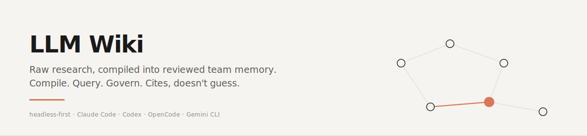

<p align="center">
  
</p>

# LLMwiki

**LLMwiki turns a team's raw research folder into a reviewed, queryable, self-improving Obsidian wiki. Headless-first. Cites, doesn't guess.**

[](LICENSE)
[](https://modelcontextprotocol.io)
[](https://github.com/2233admin/obsidian-llm-wiki/wiki)

**Language**: English (this page) · [简体中文](docs/zh-CN/) — **Guide**: [English](docs/GUIDE.md) · [简体中文](docs/GUIDE.zh-CN.md) — **Wiki**: [Home](https://github.com/2233admin/obsidian-llm-wiki/wiki) · [Architecture](https://github.com/2233admin/obsidian-llm-wiki/wiki/Architecture) · [Rationale](https://github.com/2233admin/obsidian-llm-wiki/wiki/Rationale) · [FAQ](https://github.com/2233admin/obsidian-llm-wiki/wiki/FAQ)


You are reading this because your team has already lost knowledge.

Not because nobody wrote it down. They did: papers, meeting notes, repo findings, screenshots, agent answers. The problem is worse: the knowledge has no state. No source. No reviewer. No promotion path. No way to tell a draft from team truth.

LLMwiki gives that mess a compiler pass:

```
capture -> compile -> ask -> file -> review -> promote
```

Put source material in `raw/`. Compile it into `wiki/` summaries, concept pages, backlinks, and contradiction reports. Ask agents cited questions. File useful answers into `00-Inbox/AI-Output/`. Promote only reviewed knowledge into decisions, architecture, and runbooks.

It is not an AI companion. It is a reviewed team memory compiler. Obsidian is the IDE, Git/Gitea review is the ledger, and MCP/CLI tools are the execution surface.

Inspired by [Andrej Karpathy's LLM Wiki](https://github.com/karpathy/llm-wiki). Markdown is the source of truth; the compiler turns structure into a graph; MCP exposes it.

---

## Quick start (30 seconds)

```bash
git clone --depth 1 https://github.com/2233admin/obsidian-llm-wiki.git
cd obsidian-llm-wiki && ./setup                      # --host claude | codex | opencode | gemini
```

Windows (PowerShell):

```powershell
git clone --depth 1 https://github.com/2233admin/obsidian-llm-wiki.git
cd obsidian-llm-wiki; .\setup.ps1
```

The `setup` script extracts a 1.6 MB skill bundle into your host's skills directory, prints the `.mcp.json` snippet to paste into your agent config, and exits. After restart, your agent picks up the new MCP server and the `/vault-*` knowledge-work roles. The cloned repo can then be deleted — the installed skill is self-contained. If the one-liner breaks, [docs/INSTALL.md](docs/INSTALL.md) has the per-host paths and the manual recipe.

---

## See the loop (5 minutes)

You can verify the compiler loop before wiring any agent host. This demo is local, report-only, and the compiler dry-run uses stub extraction, so it does not need an API key.

```bash
python compiler/compile.py examples/collab-vault/research-compiler --tier haiku --dry-run
python scripts/knowledge_health.py --vault examples/collab-vault --json
python scripts/llmwiki_doctor.py --vault examples/collab-vault --json
```

Then inspect the before/after:

| Step | Path |
|---|---|
| Raw source | `examples/collab-vault/research-compiler/raw/team-memory-os.md` |
| Compiled summary | `examples/collab-vault/research-compiler/wiki/summaries/team-memory-os.md` |
| Compiled concept | `examples/collab-vault/research-compiler/wiki/concepts/team-memory-os.md` |
| Filed AI output | `examples/collab-vault/00-Inbox/AI-Output/codex/project-setup-proposal.md` |
| Reviewed memory | `examples/collab-vault/20-Decisions/2026-05-16-gitea-reviewed-vault.md` |

That is the product: raw material becomes cited, inspectable, reviewable team memory.

---

## Works with

Any MCP-compatible host:

| Host | Command | Status |
|---|---|---|
| Claude Code | `./setup --host claude` | primary target, fully exercised |
| Codex CLI | `./setup --host codex` | path configured, smoke-tested |
| OpenCode | `./setup --host opencode` | path configured, smoke-tested |
| Gemini CLI | `./setup --host gemini` | path configured, smoke-tested |

Anything else speaking stdio MCP transport should work — the `setup` script only copies skills into the right directory and prints the `.mcp.json` snippet. If your host reads MCP config from somewhere else, paste the snippet there by hand.

---

## Example prompts

Cold start -- no vault context:

```
/vault-librarian what do I know about attention heads
```

Warm start -- specify a note you have:

```
/vault-librarian explain [[retrieval-augmented-generation]] in the context of my other notes on LLMs
```

Format-specific -- you want a list, not prose:

```
/vault-historian what decisions did I make about training data between January and March 2026
```

Iterate -- refine an answer:

```
/vault-curator find all orphan notes and stale notes in my vault that have not been updated in 90 days
```

---

## Compile, Query, Govern

| Loop | What happens | Durable path |
|---|---|---|
| Compile | Drop source material into `raw/`; run the compiler to produce summaries, concepts, backlinks, and contradiction reports. | `wiki/` |
| Query | Agents answer from cited vault notes and file useful drafts back into the inbox. | `00-Inbox/AI-Output/<agent>/` |
| Govern | Humans review, promote, supersede, or discard candidate knowledge. Shared team memory moves through PR review. | `20-Decisions/`, `30-Architecture/`, `40-Runbooks/` |

See [docs/RESEARCH_COMPILER_LOOP.md](docs/RESEARCH_COMPILER_LOOP.md) for the standard operating loop.

---

## Knowledge roles, one MCP surface

Each `/vault-*` command is a knowledge-work role over the same 40-operation MCP tool set. They are jobs in the pipeline, not product mascots.

| Name | What it does | Primary MCP tools |
|---|---|---|
| vault-librarian | reads, searches, cites from the vault | `vault.search`, `vault.read`, `vault.list` |
| vault-architect | compiles concept graph, suggests refactors | `vault.graph`, `vault.backlinks`, `compile.run` |
| vault-curator | finds orphans, dead links, duplicates, stale notes | `vault.lint`, `vault.searchByTag`, `vault.search` |
| vault-teacher | explains a note in context of its neighbors | `vault.backlinks`, `vault.read`, `vault.graph` |
| vault-historian | answers what you were thinking on date X | `vault.searchByFrontmatter`, `vault.stat`, `vault.search` |
| vault-janitor | proposes cleanups, dry-run by default | `vault.lint`, `vault.delete` (dry), `vault.rename` (dry) |

---

## How it works (30-second tour)

Your markdown files -- with wikilinks `[[like this]]`, aliases, frontmatter tags, and mtime -- are the source of truth. The compiler turns raw topic folders into a concept graph (nodes = notes, edges = links and semantic relationships), summaries, and concept pages. The MCP server exposes this graph as tools: `vault.search`, `vault.backlinks`, `vault.graph`, and 40+ more.

When Claude Code (or any MCP-compatible agent) runs `/vault-librarian`, it calls `vault.search` and `vault.read` directly. The agent gets citations -- not guesses.

- No embeddings required at small scale. Optional pgvector-backed semantic search via the `memU` adapter.
- No database. Filesystem-only by default; a compiled graph is cached as plain JSON alongside the vault.
- No Obsidian required at runtime. The `filesystem` adapter is always available. Obsidian is an optional adapter if you want live plugin-API features via a WebSocket bridge.

---

## Deep dives

The wiki has the long-form answers. Read them in any order.

| Page | Answers |
|---|---|
| [**Rationale**](https://github.com/2233admin/obsidian-llm-wiki/wiki/Rationale) | Why this exists. Why not just grep, not just an Obsidian plugin, not just a vector DB, not just a long-context LLM. Covers the product drift. |
| [**Architecture**](https://github.com/2233admin/obsidian-llm-wiki/wiki/Architecture) | Four-layer system diagram. Request lifecycle (8 steps, `/vault-librarian` to cited answer). Extension points. |
| [**Adapter-Spec**](https://github.com/2233admin/obsidian-llm-wiki/wiki/Adapter-Spec) | Adapter contract, capability matrix, fan-out and ranking, failure modes, recipe for a fifth adapter. |
| [**Compile-Pipeline**](https://github.com/2233admin/obsidian-llm-wiki/wiki/Compile-Pipeline) | What each stage produces, where the graph lives on disk, performance reference points. |
| [**Research Compiler Loop**](docs/RESEARCH_COMPILER_LOOP.md) | The product loop: raw materials, compiled wiki, cited Q&A, AI-Output filing, review, promotion. |
| [**Persona-Design**](https://github.com/2233admin/obsidian-llm-wiki/wiki/Persona-Design) | User-facing knowledge roles vs underlying skills. The design discipline that keeps them from collapsing into one generic agent. |
| [**Security-Model**](https://github.com/2233admin/obsidian-llm-wiki/wiki/Security-Model) | Dry-run default, protected paths, preflight gates, bearer-token transport, what this explicitly does not secure. |
| [**Recipes**](https://github.com/2233admin/obsidian-llm-wiki/wiki/Recipes) | Content collectors and local knowledge feeders (Feishu, Gmail, Linear, X, WeChat, Dreamtime, and more) that land external sources into the vault. |
| [**FAQ**](https://github.com/2233admin/obsidian-llm-wiki/wiki/FAQ) | Does it need Obsidian running? How big a vault? Why dry-run? First-draft answers, expands as questions come in. |

---

## Limits

- Does not understand code in your notes -- it indexes text, wikilinks, and structure. For AST-level code reasoning, enable the optional `gitnexus` adapter.
- Does not sync bidirectionally with Obsidian in real time -- the WebSocket adapter requires Obsidian to be running.
- Does not replace a vector database for semantic similarity at scale -- enable the optional `memU` adapter for that.
- The split between this repo (headless MCP) and its sibling `obsidian-vault-bridge` (Obsidian plugin) is still settling. See the [Rationale](https://github.com/2233admin/obsidian-llm-wiki/wiki/Rationale) page for the drift discussion.

---

## License

GPL-3.0. See [LICENSE](LICENSE).
